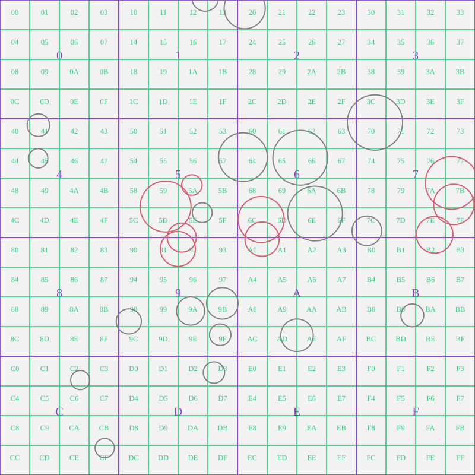
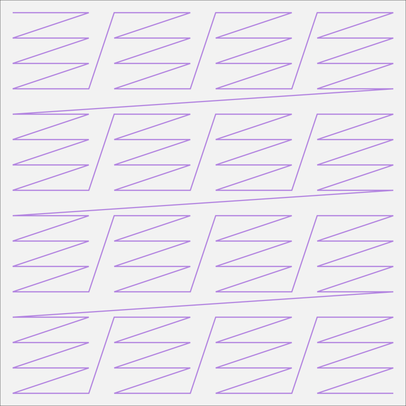
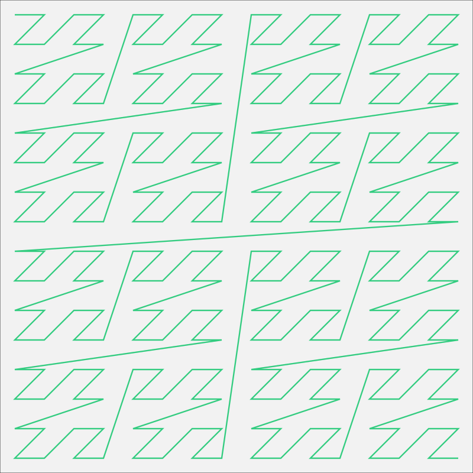
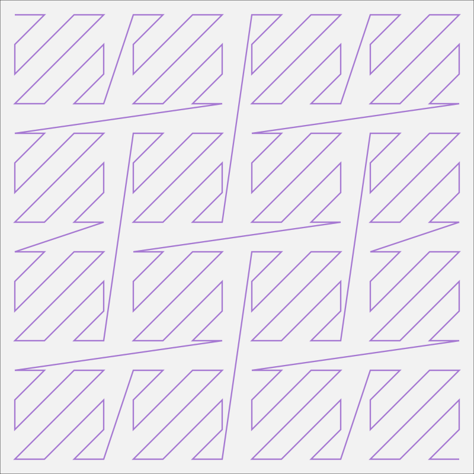

# Zgrid

Zgrid is a library for 2D spatial queries that aims to do be three things:
- Simple
- Lightweight
- Efficient

Currently zgrid only offers one data structure, `SquareTree`, for queries in 2D scenes.
This data structure is designed for realtime applications where objects are densely packed (e.g., life / particle simulators, RPG-/RTS-style games). 
With appropriate parameters, it should scale well for 20,000+ objects (more with multi-threading enabled).
A square tree won't be suitable for every application, it is likely to be much slower than alternatives for sparse scenes.
Different trees are planned in future, see the [Roadmap](#roadmap).

## Prerequisites
Zig 0.16.

## Installation

Use `zig fetch` to import the zgrid package into your project:
``` sh
zig fetch --save git+https://github.com/cottonears/zgrid
```
Then register it as a dependency in your `build.zig.zon` file:
``` zig
const zgrid_dep = b.dependency("zgrid", .{
    .target = target,
    .optimize = optimize,
});
exe.root_module.addImport("zgrid", zgrid_dep.module("zgrid"));
```

## Simple working example

This shows how you can create a square tree, populate it, and perform simple spatial queries:

``` zig
const std = @import("std");
const zgrid = @import("zgrid");
const Ball2f = zgrid.volume.Ball2f;
const Box2f = zgrid.volume.Box2f;
const Indexer = zgrid.index.Indexer2f(4, 2, 1, .Zigzag);
const SquareTree = zgrid.square_tree.SquareTree(Indexer, Box2f, u16);

pub fn main(init: std.process.Init) !void {
    const arena: std.mem.Allocator = init.arena.allocator();
    const min = @Vector(2, f32){ 0, 0 };
    const max = @Vector(2, f32){ 16, 10 };
    var tree = try SquareTree.init(arena, min, max, 50_000);
    defer tree.deinit(arena);

    var entity_aabbs: [3]Box2f = .{
        .{ .min = .{ 1.0, 1.0 }, .max = .{ 2.0, 3.0 } },
        .{ .min = .{ 1.5, 0.0 }, .max = .{ 1.8, 4.0 } },
        .{ .min = .{ 1.2, 2.0 }, .max = .{ 1.3, 2.5 } },
    };
    var entity_ids: [3]u16 = .{ 0, 1, 2 };

    // square trees can be rebuilt cheaply: clear and update every frame
    tree.clear();
    try tree.addVolumes(entity_aabbs[0..], entity_ids[0..]);
    tree.build();

    // check for overlaps with an external volume with findOverlaps
    var query_buff: [3]u16 = undefined; // NOTE: slice of u16s
    const query_ball = Ball2f{ .centre = .{ 4, 4 }, .radius = 3 };
    const query_ids = try tree.findOverlaps(&query_buff, query_ball);
    for (query_ids) |id| {
        std.debug.print("Query ball overlaps with {d}.\n", .{id});
    }

    // check for overlaps betweeen stored objects with findSelfOverlaps
    var overlaps_buff: [6][2]u16 = undefined; // NOTE: slice of u16 pairs
    const entity_pairs = try tree.findSelfOverlaps(&overlaps_buff);
    for (entity_pairs) |p| {
        std.debug.print("Entity overlap between {d} and {d}.\n", .{ p[0], p[1] });

    // TODO: line segment + kNN example
    }
}
```

There is a companion project [`zgrid-demo`](https://github.com/cottonears/zgrid-demo) that uses zgrid + SDL3 in a simple particle simulation.


## Volumes
Several types of volumes supported, describe them and contrast storable vs non-storable.
(add images!)


## SquareTree



A square tree is a uniform grid where each top-level (level 0) cell has a a bounding volume hierachy (BVH) tree beneath it.
Adding the BVH allows for more flexible queries, and better performance if some cells become densely packed.
The bottom (leaf) level grid is formed by dividing a square region of the 2D plane into smaller cells of equal size.
When volumes are added to a square tree, they are 'binned' into one of these leaf cells based on their centre position.
After all relevant volumes have been binned into their leaf cells, an axis-aligned bounding box (AABB) is fit around the volumes stored in each cell.
Then, a second level of AABBs is fit around a number of neighbouring cells' bounding boxes.
This is repeated iteratively until the top layer of AABBs (at level 0) has been created.
For efficiency, the hierachy is built using recursive indexing; see [Indexing](#indexing) for more details.

The square tree data structure uses a single slice to store all volumes (from all leaf cells) in a one large block of memory.
This has the following benefits:
- The tree allocates heap memory exactly once (on init). Adding volumes to the tree after initialisation will never trigger a heap allocation, but it may result in a `CapacityExceeded` error (if the initial capacity has been exhausted).
- The share of the overall tree's capacity used by each leaf cell is flexible and will adapt as required to the scene. This results in lower memory usage (+ safer runtime behaviour) than a naiive approach where each cell is backed by a separate slice.
- Volumes within the same leaf are stored in contiguous memory; this is important for performance.
Neighbouring leaves' volumes are also frequently adjacent in memory, though this doesn't seem to affect query speed at present.

(A paragraph about querying the tree and BFS/DTT here)

## Indexing
(Write about the recursive indexing techniques used)






## Sizing your square tree
(Tips + directions to how to size trees and use the benchmark tool on data representative of use-case, or (even better) directly imported data from a real scene).

## 0.1 TODO
- [X] Improve benchmarking reports + tooling (better stats + warmup queries).
- [X] Finish `findNearestNeighbours` (expanding-ring search).
- [X] Add `getLeafOccupancyUnderNode` + an indexer helper (e.g. `getLeafSuccessorRange`) to help with workload partitioning.
- [X] Implement helper for determining suitable number workers + parts for parallel methods.
- [X] Add findExtOverlapsSingle.
- [X] Improve indexing performance.
- [X] Parallelise build (with a radix sort?).
- [ ] Implement `getExpandedVolume(V, vol, velocity, time_step)` (makes conservative BVs for moving bodies); required to prevent tunnelling.
- [ ] Move benchmark to a separate repo to reduce compile times.
- [ ] Revamp this readme.
- [ ] Set up CI (`zig build test` on push).

## Roadmap
In no particular order:
- Allow lines to be stored? Could be useful and should be easy.
- Add support for convex hulls (definitely useful, not as easy).
- Research BIGMIN/LITMAX as potential performance improvements for neighbours search.
- Add layered_tree that wraps several trees (e.g., static + dynamic, player1, player2) and allows for easy in-tree and cross-tree queries.
- Experiment with a dynamic-depth 2D linear BVH along the lines of: https://research.nvidia.com/sites/default/files/pubs/2012-06_Maximizing-Parallelism-in/karras2012hpg_paper.pdf
